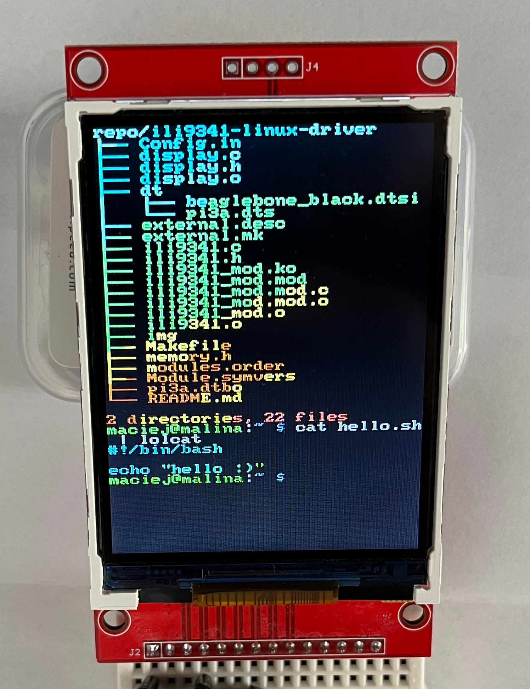
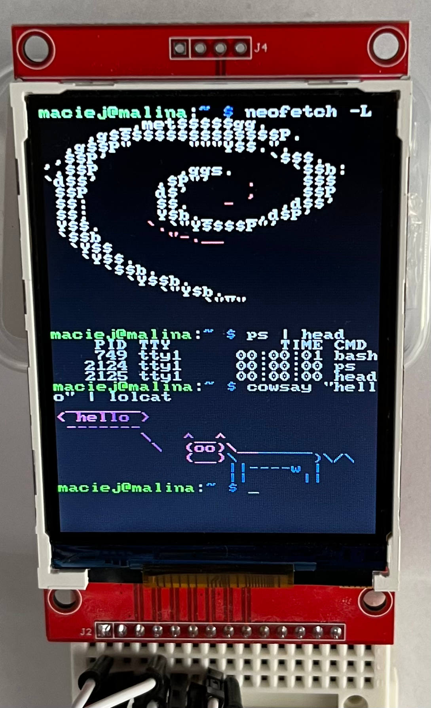
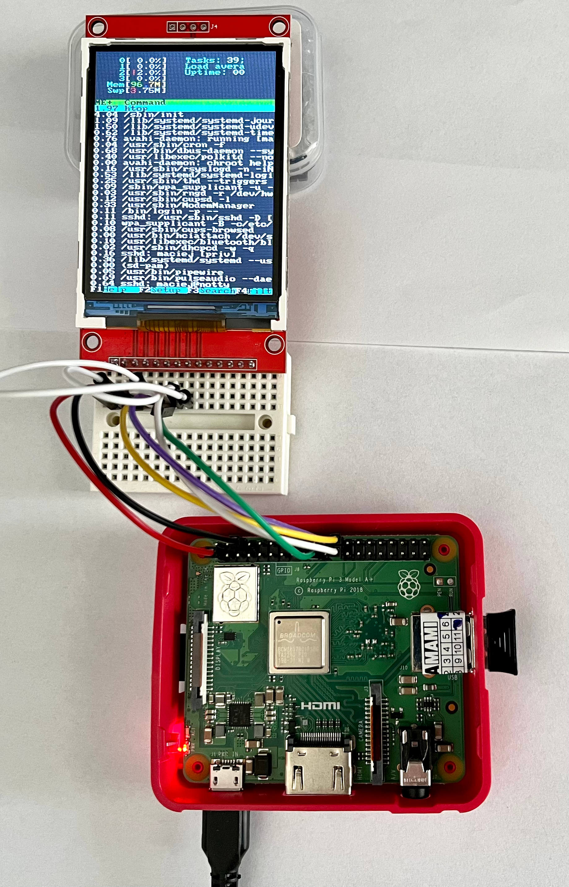

# ILI9341 Linux Driver
This repository contains my implementation of kernel driver for displays based on the ILI9341 chip.
The driver uses SPI for communication with the display and device tree for binding.
 
Overview:
* 18-bit color depth
* Uses standard SPI interface and one GPIO. GPIO is used to differentiate between command and data transfer
* Uses `fbdev` kernel framework, display is exposed to userspace as `/dev/fbX`
* Tested on BeagleBone Black Rev. C and Raspberry Pi 3A+. Additional device tree definitions must be provided when using different platforms.
* Buildroot support

## Demo

 

 

## Example
Following steps show how to build the driver on target system, RPi 3A+ has been used as an example:
* Run `make` in the cloned repository to build the driver kernel module
* Build device tree overlay: `dtc -@ -I dts -O dtb -o pi3a.dtbo dt/pi3a.dts`
* Load the overlay: `sudo dtoverlay pi3a.dtbo`
* Load the module: `sudo insmod ili9341_mod.ko`

Required packages: `linux-headers`, `build-essential`, `device-tree-compiler`